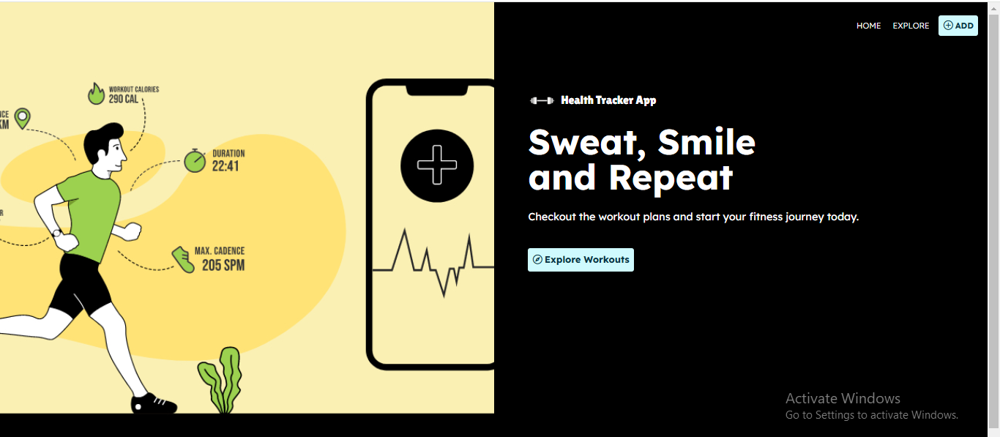
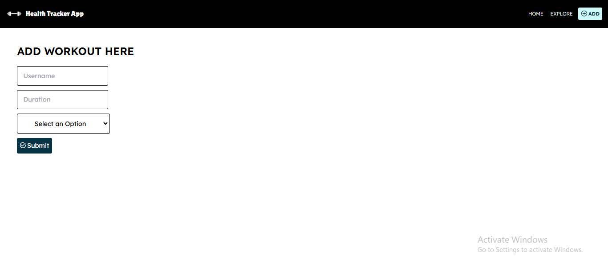
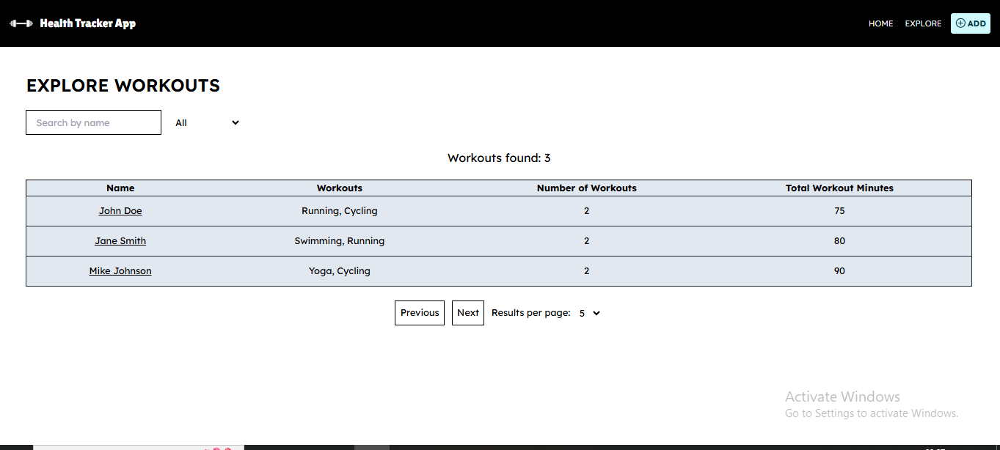
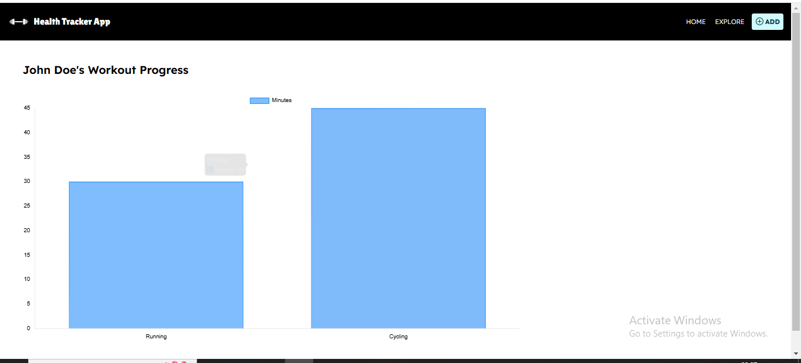

# 🏋️ Health Challenge Tracker

Welcome to the **Health Challenge Tracker** app! This application allows users to track their health challenges, including progress, filtering challenges, and visualizing data with optional charting features.







## 🚀 Features
- ✅ **User Input**: Users can input their health challenge details like name, description, and status.
- ✅ **Search**: Quickly find health challenges with search functionality.
- ✅ **Filtering**: Filter challenges based on status or type.
- ✅ **Pagination**: Navigate through multiple pages of health challenges.
- ✅ **Chart Visualization**: Optionally visualize the health challenges using charts.
- ✅ **Data Persistence**: The application uses `localStorage` to persist user data.
- ✅ **Unit Testing**: The app includes unit tests with 100% coverage for better reliability.

## 📦 Tech Stack
- **Angular 14+**: For building the single-page application (SPA).
- **Tailwind CSS**: For styling the user interface.
- **localStorage**: For storing data on the user's browser.
- **Jasmine/Karma**: For unit testing with 100% coverage.

## Project Structure
Here is an overview of the main files and directories:

- `app.component.ts`: The main component of the application.
- `app.config.ts`: Configuration file to set up the application's dependencies and environment.
- `app.routes.ts`: Contains all the routes for navigating between different parts of the app.

## 📜 Live Demo
🔗 [Health Tracker](https://health-tracker-app-7nu2.onrender.com)

##  📥 Installation

To run the app locally, follow these steps:

1. Clone the repository:
   ```bash
   git clone https://github.com/Hemanshi2954/Health-Tracker-App.git
2. Navigate to the project directory:
   ```bash
   cd Health-Tracker-App
3. Install the dependencies:
   ```bash
   npm install
4. Run the app:
   ```bash
   ng serve
5. Visit http://localhost:4200 in your browser to access the app.

## 🚀 Deployment

This application is deployed on Render / Vercel / Netlify. To deploy your own version:

Fork this repository
Connect it to Vercel / Netlify
Deploy directly from the repository
 
